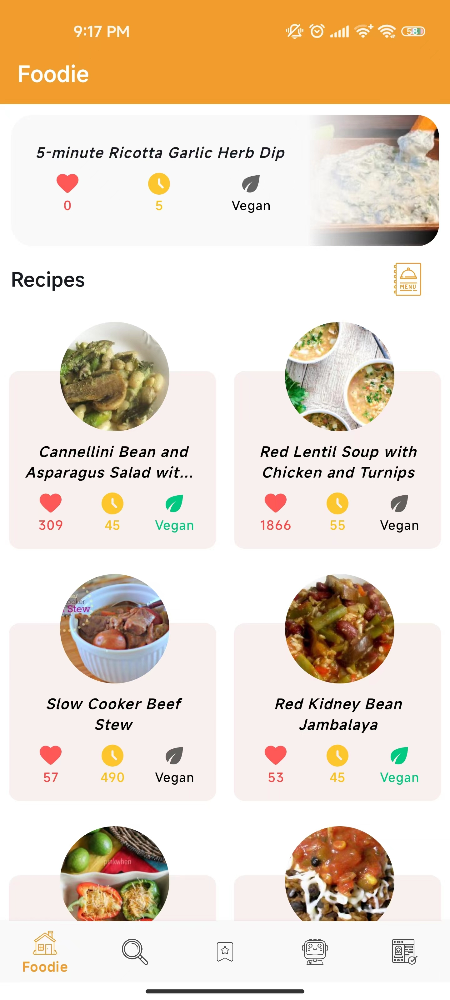
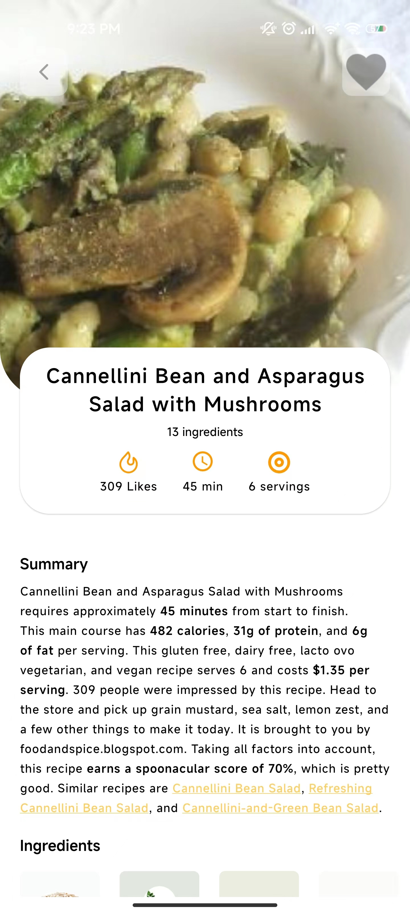
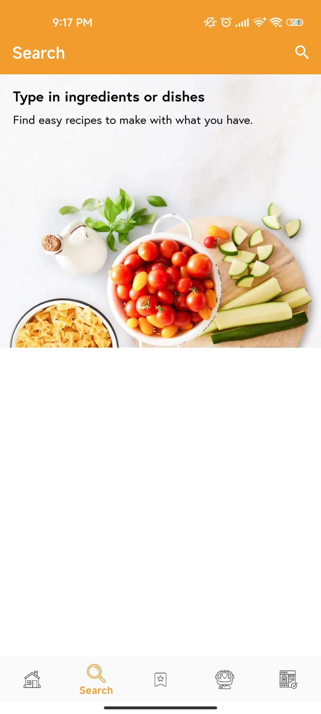
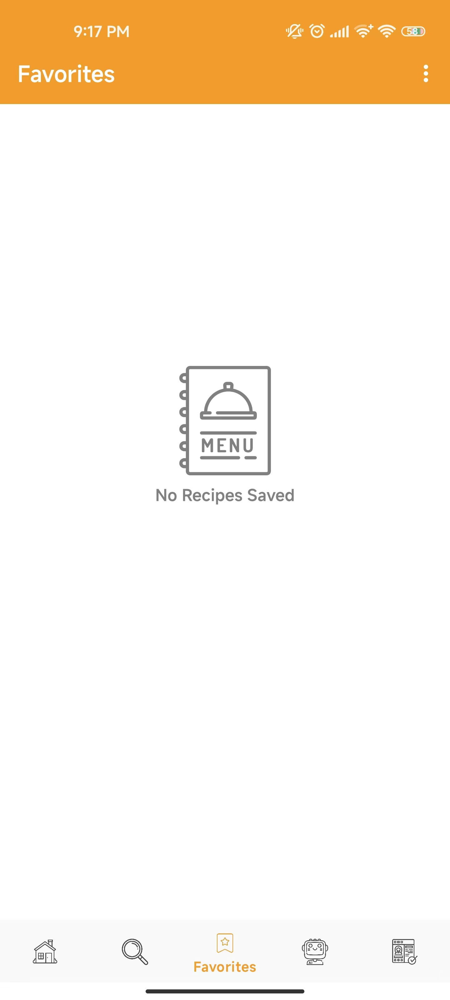
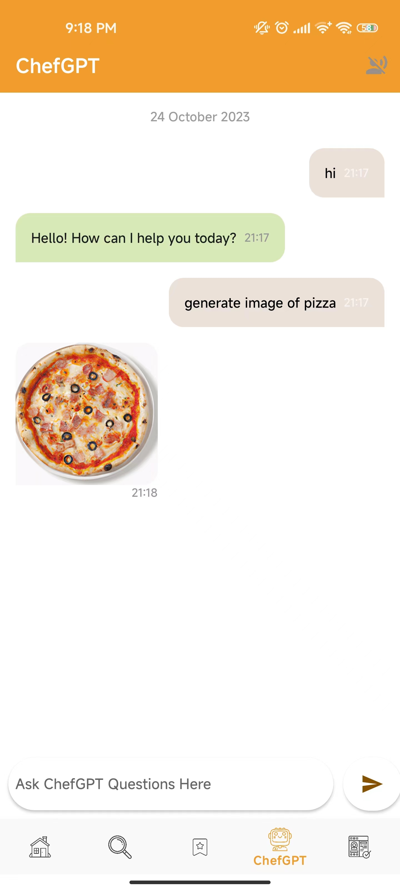
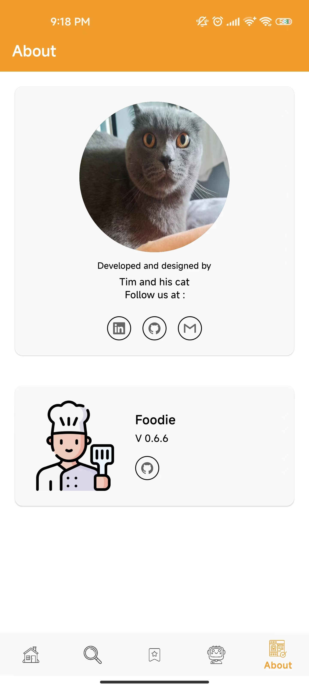

<h1 align="center">🍲 Foodie - Food Recipe App 🍲</h1>

Explore hundreds of delicious recipes at your fingertips!

---

Foodie is an app designed for food lovers who enjoy exploring new recipes and culinary adventures. Whether you're looking for a classic dish or something new and exciting, Foodie has got you covered.

## 📸 Screenshots

Explore the app through these stunning visuals!

<table>
  <tr>
     <th>Main Page</th>
     <th>Detail Page</th>
     <th>Search Page</th>
  </tr>

  <tr>
    <td>
           
   </td>
   <td>
           
   </td>
   <td>
           
   </td>
  </tr>

 </table>

 <table>
  <tr>
    <th>Favorite Page</th>
    <th>ChefGPT Page</th>
    <th>About Page</th>
  </tr>

  <tr>
   <td>
           
   </td>
   <td>
           
   </td>
   <td>
           
   </td>
  </tr>

 </table>

## 🌟 Features

- **Explore Recipes:** Browse through a vast collection of recipes.
- **Details & Ingredients:** Get detailed instructions and ingredients list for each recipe.
- **Search Functionality:** Find exactly what you're craving with the search feature.
- **Favorites:** Save your favorite recipes for easy access later.
- **ChefGPT:** Get creative with our AI-powered recipe suggestions.
- **Learn About Us:** Discover more about the creators and our mission on the About page.

## 🛠 Built With

Explore the technology stack that powers Foodie - the recipe app for food enthusiasts!

---

<strong>Kotlin</strong> - First class and official programming language for Android development.

<strong>Coroutines</strong> - For asynchronous and more...

<strong>Flow</strong> - A cold asynchronous data stream that sequentially emits values and completes normally or with an exception.

<strong>Android Architecture Components</strong> - Collection of libraries that help you design robust, testable, and maintainable apps.

<strong>LiveData</strong> - Data objects that notify views when the underlying database changes.

<strong>ViewModel</strong> - Stores UI-related data that isn't destroyed on UI changes.

<strong>ViewBinding</strong> - Generates a binding class for each XML layout file present in that module and allows you to more easily write code that interacts with views.

<strong>Room</strong> - SQLite object mapping library.

<strong>DataStore Preferences</strong> - Jetpack DataStore is a data storage solution that allows you to store key-value pairs or typed objects with protocol buffers.

<strong>Navigation Component</strong> - Navigation occurs between your app's destinations—that is, anywhere in your app to which users can navigate. These destinations are connected via actions.

<strong>Dependency Injection</strong> -

<strong>Hilt-Dagger</strong> - Standard library to incorporate Dagger dependency injection into an Android application.

<strong>Hilt-ViewModel</strong> - DI for injecting ViewModel.

<strong>Retrofit</strong> - A type-safe HTTP client for Android and Java.

<strong>OkHttp-Logging-Interceptor</strong> - Logging HTTP request related data.

<strong>Gson</strong> - Gson is a Java library that can be used to convert Java Objects into their JSON representation.

<strong>Coil-kt</strong> - An image loading library for Android backed by Kotlin Coroutines.

<strong>Offline Caching</strong> -

<strong>Material Components for Android</strong> - Modular and customizable Material Design UI components for Android.

<strong>Menu</strong> - Contextual Menu- Menus are a common user interface component in many types of applications.

<strong>Shimmer Effect</strong> - ShimmerRecyclerView is an custom RecyclerView library based on Facebook's Shimmer effect for Android library.

<strong>RoundedImageView</strong> - A fast ImageView that supports rounded corners, ovals, and circles.

<strong>Gradle Kotlin DSL</strong> - For writing Gradle build scripts using Kotlin.

---

## ⬇️ Installation

To get started with Foodie, follow these steps:

1. Clone the repository:
2. Open the project in your favorite Kotlin-supported IDE.
3. Run the application on your device or emulator.

## 🙋 Contributing

Loved the app and want to contribute? Great! We welcome contributions. Please read our contributing guide to get started.

## 📝 License

Foodie is released under the MIT License. See [LICENSE](LICENSE) for details.

---

Happy Cooking! 🎉
